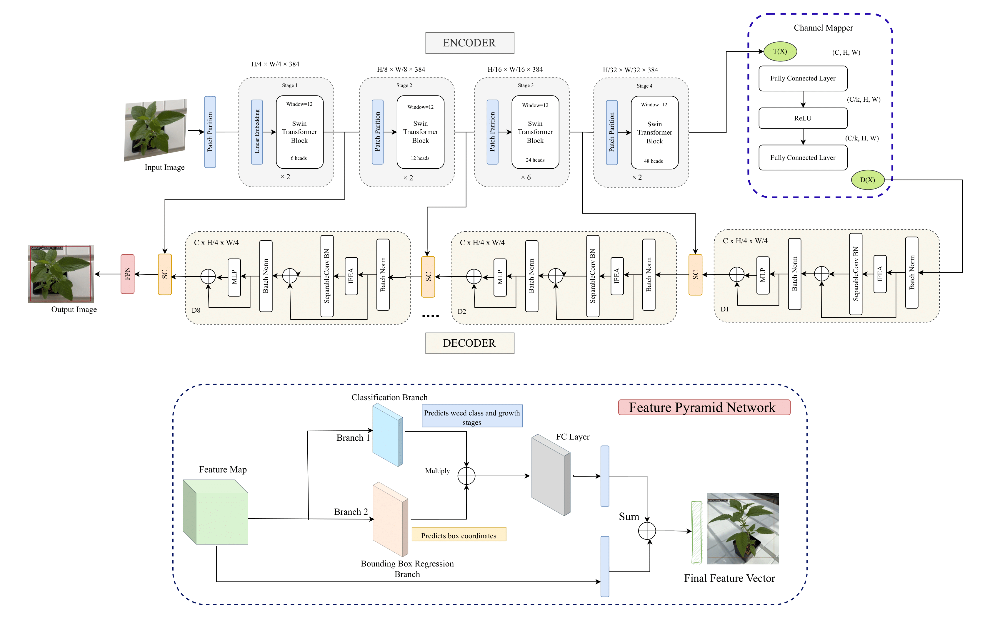

<div align="center">
<h1>WeedSwin hierarchical vision transformer with SAM-2 for multi-stage weed detection and classification</h1>

[Taminul Islam](https://scholar.google.com/citations?user=Kgo_S9sAAAAJ&hl=en&oi=ao)<sup>1</sup>, [Toqi Tahamid Sarker](https://scholar.google.com/citations?hl=en&pli=1&user=i1SmuwYAAAAJ)<sup>1</sup>,[Khaled R Ahmed](https://scholar.google.com/citations?user=FYKqgh4AAAAJ&hl=en)<sup>1</sup>, [Cristiana Bernardi Rankrape]()<sup>2</sup> [Karla Gage](https://scholar.google.com/citations?user=6IqTa8AAAAAJ&hl=en)<sup>3</sup>,

<sup>1</sup> School of Computing, <sup>2</sup> School of Agricultural Sciences, <sup>3</sup> School of Biological Sciences

Southern Illinois University Carbondale

<!-- Paper: ([arXiv 2404.10841](https://arxiv.org/abs/2404.10841)) -->

</div>

<div align="center">

[](https://doi.org/10.1038/s41598-025-05092-z)
[](https://doi.org/10.5281/zenodo.15808623)

</div>

- [Abstract](#abstract)
- [Getting Started](#getting-started)
  - [WeedSwin Installation](#weedswin-installation)
<!-- - [Star History](#star-history) -->
<!-- - [Citation](#citation) -->
<!-- - [Acknowledgment](#acknowledgment) -->

## Abstract
Weed detection and classification using computer vision and deep learning techniques have emerged as crucial tools for precision agriculture, offering automated solutions for sustainable farming practices. This study presents a comprehensive approach to weed identification across multiple growth stages, addressing the challenges of detecting and classifying diverse weed species throughout their developmental cycles. We introduce two extensive datasets: the Alpha Weed Dataset (AWD) with 203,567 images and the Beta Weed Dataset (BWD) with 120,341 images, collectively documenting 16 prevalent weed species across 11 growth stages. The datasets were preprocessed using both traditional computer vision techniques and the advanced SAM-2 model, ensuring high-quality annotations with segmentation masks and precise bounding boxes. Our research evaluates several state-of-the-art object detection architectures, including DINO Transformer (with ResNet-101 and Swin backbones), Detection Transformer (DETR), EfficientNet B4, YOLO v8, and RetinaNet. Additionally, we propose a novel WeedSwin Transformer architecture specifically designed to address the unique challenges of weed detection, such as complex morphological variations and overlapping vegetation patterns. Through rigorous experimentation, WeedSwin demonstrated superior performance, achieving 0.993 ± 0.004 mAP and 0.985 mAR while maintaining practical processing speeds of 218.27 FPS, outperforming existing architectures across various metrics. The comprehensive evaluation across different growth stages reveals the robustness of our approach, particularly in detecting challenging "driver weeds" that significantly impact agricultural productivity. By providing accurate, automated weed identification capabilities, this research establishes a foundation for more efficient and environmentally sustainable weed management practices. The demonstrated success of the WeedSwin architecture, combined with our extensive temporal datasets, represents a significant advancement in agricultural computer vision, supporting the evolution of precision farming techniques while promoting reduced herbicide usage and improved crop management efficiency.

<p align="center">
  <div style="position: relative; display: inline-block;">
    
    <!--  -->
  </div>
</p>


## Getting Started

### WeedSwin Installation

**Step 1: Clone the WeedSwin repository:**

To get started, first clone the WeedSwin repository and navigate to the project directory:

```bash
git clone https://github.com/taminulislam/weeds.git
cd weeds
```

**Step 2: Environment Setup:**

WeedSwin recommends setting up a conda environment and installing dependencies via pip or conda. Use the following commands to set up your environment:

***Create and activate a new conda environment***

```bash
conda create -n weedswin python=3.8
conda activate weedswin
```

***Install PyTorch and CUDA***

```bash
conda install pytorch torchvision torchaudio pytorch-cuda=11.8 -c pytorch -c nvidia
```

***Install MMSegmentation dependencies***

```bash
pip install -U openmim
mim install mmengine
mim install "mmcv>=2.0.0"
```

***Install additional packages***

```bash
conda install conda-forge::ftfy
conda install conda-forge::tensorboard
pip install wandb
conda install anaconda::ipykernel
```

***Verification***

WeedSwin is based on MMDetection 3.0.0, so we need to check the versions of PyTorch, MMCV and MMDetection.

```bash
python -c "import torch, mmcv, mmdet; print(torch.__version__, mmcv.__version__, mmdet.__version__)"
```

## Dataset

The Weed Growth Stage Dataset used in this research is publicly available on Zenodo:

[](https://doi.org/10.5281/zenodo.15808623)

Dataset: [https://doi.org/10.5281/zenodo.15808623](https://doi.org/10.5281/zenodo.15808623)

## Citation

```
@article{islam2025weedswin,
  title={WeedSwin hierarchical vision transformer with SAM-2 for multi-stage weed detection and classification},
  author={Islam, Taminul and Sarker, Toqi Tahamid and Ahmed, Khaled R and Rankrape, Cristiana Bernardi and Gage, Karla},
  journal={Scientific Reports},
  volume={15},
  number={1},
  pages={23274},
  year={2025},
  publisher={Nature Publishing Group UK London}
}
```

<!-- ## Star History

[](https://star-history.com/#toqitahamid/Gasformer&Date) -->

<!-- ## Citation

```
@article{sarker2024gasformer,
      title={Gasformer: A Transformer-based Architecture for Segmenting Methane Emissions from Livestock in Optical Gas Imaging}, 
      author={Toqi Tahamid Sarker and Mohamed G Embaby and Khaled R Ahmed and Amer AbuGhazaleh},
      journal={arXiv preprint arXiv:2404.10841},
      year={2024},
}
``` -->
<!-- 
## Acknowledgment

This project is based on Segformer ([paper](https://arxiv.org/abs/2105.15203), [code](https://github.com/NVlabs/SegFormer/tree/master)), Light-Ham ([paper](https://arxiv.org/abs/2109.04553), [code](https://github.com/Gsunshine/Enjoy-Hamburger/tree/main/seg_light_ham)), and [MMsegmentation](https://github.com/open-mmlab/mmsegmentation). Thanks for their excellent works. -->
